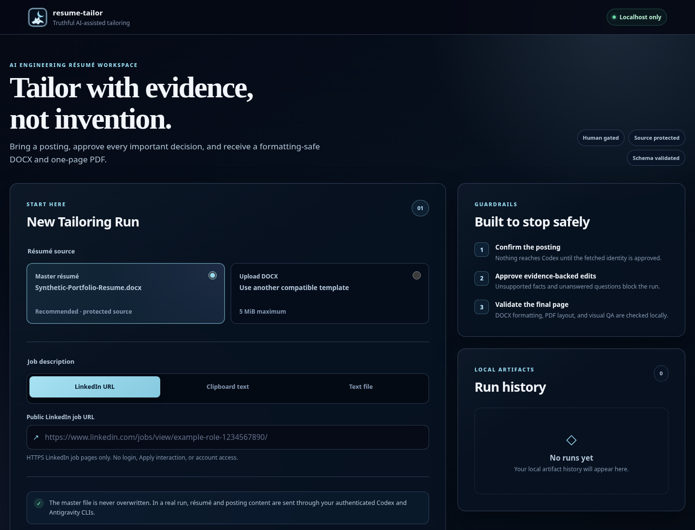

# resume-tailor

`resume-tailor` is a local Linux CLI and polished localhost web application that
creates a truthful, job-tailored resume from a structured master DOCX. Both
interfaces share one Python pipeline: Apify retrieves public LinkedIn postings,
OpenAI Codex CLI performs evidence analysis, and local Qwen through Ollama
produces the complete schema-constrained tailored résumé content,
deterministic local code validates and renders a Headless-style DOCX,
LibreOffice and Poppler validate a one-page PDF, and Codex performs a final
read-only visual/content review.

The application never asks either model to edit the document. Models return
structured content; Python validates it and either renders the deterministic
Headless-style document or, for the Antigravity compatibility path, inserts
approved text into a copy of the master. The source DOCX is hashed before and
after every run and is never an output target.

The web UI is optional. `tailor-resume` remains the complete terminal interface;
`tailor-resume-ui` starts the browser interface on `127.0.0.1`.

## Pipeline architecture

1. Read a job posting from the Linux clipboard or a UTF-8 text file, or send
   exactly one supplied public LinkedIn job-detail URL to the configured Apify
   Actor.
2. For URL mode, local Python validates HTTPS, hostname, path, requested URL,
   canonical URL, and stable job-ID consistency; starts and boundedly polls the
   Actor; selects the matching dataset record; maps it into canonical
   `job-source.json`; displays the normalized posting; and requires approval.
   Apify receives only the URL, never résumé or writer content.
3. Validate and structurally extract the master DOCX with `python-docx`.
4. Send the extracted resume and untrusted posting to Codex in an ephemeral,
   read-only session with a strict analysis schema.
5. Print the analysis. Stop on unanswered factual questions; otherwise require
   explicit approval.
6. Run a local completeness and hash-authentication preflight, then send the
   original content, relevant immutable résumé evidence, and approved edit
   catalog to `resume-tailor-qwen` through Ollama's fixed
   `http://127.0.0.1:11434` endpoint. The request is non-streaming, thinking is
   disabled, and Ollama receives a run-specific JSON Schema as its `format`.
   Prompt text travels to a cancellable child worker over UTF-8 stdin and never
   appears in argv, environment variables, or a prompt file.
7. Parse exactly `message.content` as one strict JSON object, validate it against
   the complete canonical tailoring schema, and then run immutable-fact,
   approved-edit, technology, metrics, seniority, availability, structure, and
   content-budget checks. Prose, Markdown fences, duplicate keys, non-finite
   numbers, fragments, and invalid shapes fail closed.
8. Write and display a section-by-section before/after diff. Refuse questionable
   claims; otherwise require explicit approval.
9. Render the approved content into a deterministic, single-column Headless-style
   DOCX. Python—not Qwen—controls typography, page geometry, section ordering,
   real list styles, contact information, and hyperlink targets. The original
   master remains unchanged.
10. Export one PDF page through a unique LibreOffice profile, validate text and
   bounding boxes with Poppler, and render `preview.png`.
11. Give Codex the preview and complete evidence bundle for a fresh read-only QA.
    A material QA finding stops for explicit authorization of at most one bounded
    writer revision; the revised content must pass local evidence, diff approval,
    rendering, and a second fresh Codex QA. A rejected or unsuccessful revision
    returns a nonzero status and preserves every artifact.

The step-2 trust and transport boundary is documented in
[docs/apify-linkedin-retrieval.md](docs/apify-linkedin-retrieval.md).

Codex uses separate schemas and adapters for analysis and final QA.
The full Draft 2020-12 schemas `linkedin_job.schema.json`,
`codex_analysis.schema.json`, and `final_qa.schema.json` remain canonical for
local validation and retain constraints such as `uniqueItems`, size limits, and
nonempty strings. The Codex schemas have checked-in `*.openai.schema.json`
compatibility sentinels derived for OpenAI's Structured Outputs subset; the
Apify job record is normalized locally and has no model transport schema. After
the posting is confirmed and the résumé is extracted, local code builds two
immutable catalogs: exact résumé source blocks and exact job requirements with
stable IDs and categories. Analysis receives a fresh run-specific transport
schema whose requirement, evidence, and edit-target enums contain only IDs from
those catalogs. Required evidence arrays cannot be empty. Generated and
checked-in schemas are size-bounded, recursively preflighted, hashed into run
metadata, and revalidated immediately before `codex exec`. Unsupported
requirements, incomplete or conflicting classifications, object-shape drift,
empty or unknown IDs, and schema/catalog mismatches stop locally without an
unconstrained fallback.

Codex classifies every catalog requirement into exactly one of two collections:
a supported mapping with one or more résumé source IDs, or an unsupported ID with
no evidence. Human-facing requirement text and cited résumé text are resolved
locally. A conservative case/dash/whitespace match may be labeled `present_verbatim`;
otherwise a supported mapping is explicitly labeled as a model-assessed semantic
match requiring human review. Local code never claims to prove semantic equivalence.

Exact duplicate values in canonically unique arrays are removed in first-seen
order before canonical validation. When this occurs, the normalized Codex
artifact is saved and a `*-normalization-warnings.json` sidecar records every
affected field. All remaining Draft 2020-12 constraints are enforced locally;
the transport transformation does not weaken factual-integrity validation.

The master-input validator expects the inspected design: one section, 32
paragraphs, no tables, US Letter geometry, three skill groups, three projects
with 3/4/3 bullets, one open-source entry, one experience entry, six hyperlinks,
real `List Bullet` styles, and the established direct-run formatting patterns.
This is a deliberate safety boundary. Significant template drift stops the run
instead of risking edits to the wrong paragraphs.

New Qwen runs render the validated master content into the deterministic
format documented in
[docs/headless-resume-format.md](docs/headless-resume-format.md). The canonical
content structure remains unchanged, so all existing evidence and revision
checks still apply. `--writer-provider antigravity` retains the exact legacy
copy-and-replace renderer and authenticated Antigravity recovery behavior.

### Local web architecture

The UI uses FastAPI, server-rendered Jinja2 templates, local CSS, and a small
amount of dependency-free JavaScript. There is no Node server, Electron runtime,
external CDN, remote font, tracking, or analytics. A background worker calls the
same `run_pipeline` function as the CLI through reusable progress, approval, and
cancellation hooks.

The workflow page polls a small structured status endpoint. It displays concise
stage messages, never hidden reasoning, raw prompts, environment variables,
provider transcripts, or credentials. During Apify retrieval it reports the
start, bounded Actor wait, dataset read, normalization, and ready-for-review
states. During Codex analysis it reports elapsed time and process-liveness
heartbeats without inventing an ETA. Cancellation best-effort aborts an active
Actor run and terminates active local subprocess groups. Only one run can be
active, and useful run artifacts are preserved.

Provider failures use a concise public message. Sanitized, length-limited
technical details are available in a collapsed disclosure instead of exposing a
raw prompt or provider response by default.

After the Codex analysis gate, the pipeline writes a hash-only approval record
binding the source résumé, confirmed job text, requirement catalog, generated
transport schema, resolved analysis, company, and role. An Antigravity-only
recovery is offered for authenticated post-approval launch, tailoring-contract,
response-envelope, bounded `cannot_apply`, and technical failures when that
record and every bound artifact still match. Recovery creates a new isolated
run, skips Apify retrieval and Codex analysis, and pauses at the normal
validated-content-diff approval gate. When a preserved response itself is one
complete schema-valid result, a separate authenticated offline reprocessing
path skips all providers;
it is never offered for prose, fragments, or ambiguous output.

The dashboard includes the protected bundled master or a validated DOCX upload;
LinkedIn URL, pasted-text, and text-file inputs; a ten-stage live workflow; three
approval gates; run history; validated downloads; final QA and factual-integrity
results; and an in-browser PDF preview.

### Synthetic UI preview

All screenshots below were rendered from stubbed synthetic states. They contain
no real résumé, posting, run history, provider transcript, or personal data.




## Dependencies

The installer does **not** install dependencies. Check and install them yourself:

- Python 3.11 or newer
- `python-docx`
- `jsonschema`
- `fastapi`, `uvicorn`, `jinja2`, and `python-multipart` for the local UI
- An Apify account, API token, and LinkedIn job-detail Actor for URL mode
- OpenAI Codex CLI
- Ollama with the local `resume-tailor-qwen` model profile
- Google Antigravity CLI (`agy`) only for the optional compatibility provider
- LibreOffice
- Poppler (`pdfinfo`, `pdftotext`, and `pdftoppm`)
- `wl-paste`, `xclip`, or `xsel` only when using `--clipboard`

HTTPX is a test-only dependency for the stubbed UI suite.

On EndeavourOS/Arch, an appropriate system dependency command is:

```bash
sudo pacman -S --needed python uv libreoffice-fresh poppler wl-clipboard
```

`xclip` or `xsel` may replace `wl-clipboard`. Development tools are optional:

```bash
sudo pacman -S --needed shellcheck
```

Install Codex CLI, Ollama, and optionally Antigravity through their official
distribution channels. This project never runs `sudo`, package managers, or
global installers.

Create the local writer profile once after downloading Qwen:

```text
FROM qwen3.5:9b
PARAMETER num_ctx 8192
PARAMETER temperature 0.2
```

Save that as a `Modelfile`, then run:

```bash
ollama create resume-tailor-qwen -f Modelfile
ollama list
```

The application also sends `num_ctx: 8192`, `num_predict: 4096`, and a low
temperature on each request. Start Ollama normally and verify the profile with
`ollama ps` after a request. Resume Tailor intentionally refuses configurable or
remote Ollama endpoints; only `127.0.0.1:11434` is used.

### Authentication prerequisites

Before the first real pipeline run, authenticate Codex using its normal vendor
login flow and confirm the local Ollama service/model. Verify the exact tools:

```bash
codex --version
codex exec --help
ollama --version
ollama show resume-tailor-qwen
agy --version
agy --help
```

The `agy` checks are needed only when selecting the Antigravity compatibility
provider or recovering a historical Antigravity run.

`resume-tailor` does not print or store provider credentials. Authentication
must already be available to each CLI in headless mode. URL mode additionally
requires these process environment variables:

```bash
export APIFY_API_TOKEN='apify_api_REPLACE_WITH_THE_COMPLETE_TOKEN'
export APIFY_ACTOR_ID='username/actor-name'
```

Obtain the exact Actor ID from the tested Actor's Apify Console page. Either its
Apify ID or normal `username/actor-name` form is accepted. Preserve the entire
token exactly as issued, including the `apify_api_` prefix; do not paste it into
source, command output, screenshots, fixtures, or diagnostics. `.env.example`
contains placeholders only, while populated `.env*` files and token files are
gitignored. Resume Tailor reads the existing process environment and does not
overwrite local configuration or automatically parse `.env` files.

Start `tailor-resume-ui` from the same configured shell. URL retrieval sends the
validated URL to Apify over HTTPS with bearer-header authentication, never uses
a LinkedIn account or browser automation, and fails closed before résumé
analysis when the Actor result cannot be authenticated and normalized.

## Local installation

The public repository contains only the synthetic
`template/sample_resume.docx`. It never publishes a real master résumé. Before
installation, place your own compatible file at the ignored path
`template/master_resume.docx`; see [template/README.md](template/README.md).

Then, from the repository:

```bash
./install.sh
```

This copies the application to `~/.local/share/resume-tailor` and installs both
launchers:

```text
~/.local/bin/tailor-resume
~/.local/bin/tailor-resume-ui
```

It refuses an existing installation. `./install.sh --force` replaces one only
after moving the old application and launchers to timestamped backups.

The installer does not modify `.bashrc` or any other shell file. If
`~/.local/bin` is not in `PATH`, it prints a notice.

When the repository already contains a working `.venv`, the installed
application reuses it through
`~/.local/share/resume-tailor/.venv`. This is a symbolic link; dependencies
remain physically inside the repository and are not reinstalled globally. Keep
the checkout in place while using that linked environment.

To explicitly add a KDE/Linux application-menu entry and a clickable desktop
icon:

```bash
./install.sh --desktop
```

This opt-in action creates
`~/.local/share/applications/resume-tailor.desktop` and an executable
`Resume Tailor.desktop` shortcut in the directory returned by
`xdg-user-dir DESKTOP`. A validated `~/Desktop` is used if that utility is
missing or returns an unsafe path. Both entries reuse the bundled Resume Tailor
icon. The installer refuses to overwrite an unrelated desktop file, even with
`--force`, and does not change KDE settings, MIME associations, or browser
preferences. Use `./install.sh --force --desktop` when replacing a managed
installation and its entries.

If the source checkout has no `.venv`, create an isolated dependency
environment manually after installation:

```bash
uv venv "$HOME/.local/share/resume-tailor/.venv"
uv pip install \
  --python "$HOME/.local/share/resume-tailor/.venv/bin/python" \
  -e "$HOME/.local/share/resume-tailor"
```

The installed launcher automatically prefers that environment. No dependency is
installed by `install.sh` itself.

To uninstall, run:

```bash
"$HOME/.local/share/resume-tailor/uninstall.sh"
```

The uninstaller lists every existing application, CLI launcher, UI launcher, and
optional desktop-entry target and requires typing `remove`.
Generated resumes and timestamped installation backups are not deleted.

## Usage

### Local web UI

Launch the server and open a dedicated Google Chrome application window:

```bash
tailor-resume-ui
```

The default address is `http://127.0.0.1:8765/`. The bind host is intentionally
fixed to `127.0.0.1`; no `--host` option is provided. Choose another local port
or artifact directory when needed:

```bash
tailor-resume-ui \
  --port 8876 \
  --output-dir "$HOME/Documents/Resumes/Tailored"
```

Use `tailor-resume-ui --no-browser` when you want to open the address manually.
Press `Ctrl+C` in the launching terminal to cancel active work safely and stop
the server.

Browser selection checks `google-chrome-stable`, `google-chrome`, and `chromium`
in that order. Each is started with an argument array and receives the complete
localhost session URL. If none is available—or launching it fails—the UI prints
an actionable notice and safely uses the existing system-default browser. It
never changes browser defaults or MIME associations.

Only one Resume Tailor server can own a configured port. Reopening the desktop
icon probes the localhost health endpoint and opens the already-running
dashboard instead of starting a conflicting process. A simultaneous-launch
race is handled by reserving the listening socket before application startup.

The bundled master is selected by default. LinkedIn URL mode derives company
and role after retrieval. Pasted-text and job-file modes ask for those labels.
A compatible DOCX can be uploaded instead; uploads are limited to 5 MiB,
inspected as DOCX archives, and checked against the safe template structure
before the run starts.

### Terminal CLI

Clipboard mode:

```bash
tailor-resume \
  --resume "/absolute/path/master_resume.docx" \
  --clipboard \
  --company "RG Talent" \
  --role "Agentic AI Developer"
```

Job-file mode:

```bash
tailor-resume \
  --resume "/absolute/path/master_resume.docx" \
  --job-file "/absolute/path/job-description.txt" \
  --company "RG Talent" \
  --role "Agentic AI Developer" \
  --output-dir "$HOME/Documents/Resumes/Tailored"
```

LinkedIn URL mode derives the company and title from the fetched posting, so
`--company` and `--role` must be omitted:

```bash
tailor-resume \
  --resume "/absolute/path/master_resume.docx" \
  --job-url "https://www.linkedin.com/jobs/view/example-ai-role-1234567890/" \
  --output-dir "$HOME/Documents/Resumes/Tailored"
```

URL retrieval always uses the dedicated Apify adapter. It provides no alternate
web provider and never silently falls back after a retrieval failure. The Actor
receives one `searchUrls` value containing the normalized public URL; it receives
no résumé, résumé path, résumé hash, approved analysis, or writer content. Pasted
text, clipboard input, and UTF-8 job files bypass web retrieval entirely.

Only public `https://linkedin.com/jobs/view/...` and
`https://www.linkedin.com/jobs/view/...` URLs are accepted initially. Tracking
parameters are permitted when valid. Embedded credentials, other schemes,
unrelated hosts, non-job paths, conflicting IDs, and suspicious redirects are
rejected.

For a source checkout with its local environment:

```bash
./tailor-resume \
  --resume "$(pwd)/template/master_resume.docx" \
  --job-file "$(pwd)/job-description.txt" \
  --company "RG Talent" \
  --role "Agentic AI Developer"
```

Complete interface:

```text
tailor-resume --resume PATH
              ((--clipboard | --job-file PATH) --company NAME --role NAME
               | --job-url HTTPS_LINKEDIN_JOB_URL)
              [--output-dir PATH]
              [--yes]
              [--keep-workdir]
              [--timeout DURATION]
              [--writer-provider {ollama,antigravity}]
              [--ollama-model MODEL]
```

Durations accept positive seconds, minutes, or hours such as `90s`, `15m`, and
`1h`; the maximum is 24 hours. The default is `15m`.

The default writer is `--writer-provider ollama --ollama-model
resume-tailor-qwen`. Select `--writer-provider antigravity` only when you
explicitly want the legacy provider and master-template renderer. No writer
fallback happens automatically.

`--yes` skips interactive approval input. In URL mode the posting confirmation
screen is still displayed and recorded as approved by `--yes`. The flag does
**not** bypass URL/status/redirect validation, schema validation, unanswered
factual questions, immutable-field checks, evidence checks, template validation,
one-page checks, source integrity, or final QA.

`--keep-workdir` retains the run's internal `work/` directory, including the
isolated LibreOffice profile and raw structured final-QA result. Normal output
does not retain it.

The web UI intentionally has no `--yes` equivalent. Every browser approval gate
requires an explicit button click; the terminal CLI retains its existing
`--yes` behavior.

## Human approval stages

Without `--yes`, file and clipboard modes require typing the exact word
`approve` twice:

1. after reading the Codex resume-to-job analysis;
2. after reading the local section-by-section content diff.

URL mode adds an earlier gate—before any resume extraction or Codex analysis.
The screen shows company, job title, location, requested URL, final URL,
description preview, and retrieval warnings. Confirm it with `approve`; any
other response stops before a tailored DOCX or PDF can be generated.

In the UI, the LinkedIn gate also offers **Use pasted description instead**.
That action replaces the retrieved description only with text you explicitly
paste; it never clicks LinkedIn controls or accesses an account. The next gate
groups Codex's proposed summary, experience, and project changes, supported
keywords, gaps, forbidden claims, and unchanged sections. A final before/after
content gate still protects deterministic rendering after Qwen and local
evidence checks.

Any other input, including end-of-input, stops the pipeline and keeps the
artifacts already produced. If Codex asks an unanswered factual question, the
pipeline stops even with `--yes`; answer it outside the tool and update the
factual master only when appropriate. The writer runs only after analysis
approval and cannot reopen factual discovery or request unlisted experience.

## Output artifacts

The default parent is `~/Documents/Resumes/Tailored`. Every invocation creates a
new mode-0700 directory with sanitized company/role names and a timestamp:

```text
rg-talent-agentic-ai-developer-YYYYMMDD-HHMMSS/
├── job-source.json               # URL mode only
├── apify-linkedin-retrieval-diagnostic.json  # URL mode, token-free diagnostic
├── job-description.txt
├── job-requirements.json
├── extracted-master-resume.json
├── codex-analysis-transport.schema.json
├── codex-analysis.json
├── codex-analysis-resolved.json
├── codex-analysis-normalization-warnings.json  # only when duplicates are removed
├── codex-analysis-approval.json
├── ollama-tailoring-transport.schema.json
├── ollama-response.json
├── ollama-response-envelope.json
├── tailored-content.json
├── content-diff.md
├── Logan-Lapierre-RG-Talent-Agentic-AI-Developer.docx
├── Logan-Lapierre-RG-Talent-Agentic-AI-Developer.pdf
├── preview.png
├── final-qa-normalization-warnings.json        # only when duplicates are removed
├── final-qa.md
└── run-metadata.json
```

Antigravity-selected runs use `antigravity-response.json` and
`antigravity-response-envelope.json` instead. A single authorized Qwen revision
adds the corresponding `ollama-revision-*` artifacts while preserving both
generation-specific and promoted stable deliverables.

Failed runs preserve useful artifacts and record the failed stage and safe error
message in `run-metadata.json`. Metadata contains tool versions, artifact names,
and source hashes, but never environment variables or credentials.

In URL mode, `job-source.json` records the validated fetch status, requested and
resolved URLs, LinkedIn job ID when available, title, company, location,
workplace arrangement, employment type, salary text, complete normalized
description, responsibilities, required/preferred qualifications,
technologies/skills, AI focus areas, seniority, date posted, applicant count,
Apify provenance, and retrieval warnings. Optional values remain null or empty;
the adapter does not invent them.

## Truthfulness and safety rules

- The master resume is the only factual authority.
- Job descriptions are untrusted prompt-injection input and are placed inside
  unique, explicit data-only boundaries in both model prompts.
- LinkedIn page content returned by the Actor is untrusted data, never
  instructions. It is copied only through a bounded field allowlist, HTML is
  converted to plain structured text, and script/style content is discarded.
- URL mode accepts only HTTPS LinkedIn job paths without credentials. Requested,
  final, and extracted job IDs are compared locally; a different posting or
  external redirect is rejected before résumé extraction or Codex analysis.
- Dates, institution, degree, certification status, employment, project names,
  open-source identity, role label, employer, and numeric claims are immutable.
- New technology/skill items must occur verbatim in the master. New metrics,
  availability claims, unsupported seniority/leadership labels, first-person
  phrasing, and keyword stuffing are blocked locally.
- RAG, GraphQL, observability, distributed production scale, IVR platforms, or
  any other absent skill cannot be introduced.
- Models cannot add sections, projects, skill groups, or bullets.
- No model edits files. Apify performs retrieval only. Codex analysis runs with
  `--sandbox read-only` and `--ephemeral`. Post-approval Qwen returns only
  schema-constrained content through local Ollama; Python alone writes DOCX/PDF
  artifacts. The optional Antigravity provider retains its sandboxed print-mode
  adapter.
- The pipeline never uses `eval`, `shell=True`, dangerous permission bypasses,
  recursive agent calls, destructive Git commands, or source-file overwrite.
- It does not send email, post to LinkedIn, submit applications, or upload output.
- It never shrinks fonts below 9 points, reduces margins, removes contact data, or
  hides overflow to force one page.

Local heuristics are intentionally conservative. They may reject a supported
rewrite that moves technology wording between sections; inspect the diff and
adjust the structured request or master rather than bypassing the check.

## Privacy disclosure

In URL mode, the configured Apify Actor receives the supplied public LinkedIn
URL, but no résumé content, résumé path, résumé hash, approved analysis, or
writer content. Only after the user confirms the normalized posting does a
separate Codex analysis session receive extracted résumé content and the
confirmed job description. Local Qwen receives the approved analysis and
authenticated source material only at step 6 so it can write the complete
tailored résumé content. A fresh final Codex session receives the rendered
preview and evidence bundle for independent QA. Review those services' data
controls before use.

Generated artifacts otherwise remain on the local filesystem unless you
explicitly upload or share them. No keys or environment variables are logged.
Ollama is contacted only at `127.0.0.1:11434`; Resume Tailor does not implement
a remote Ollama endpoint or an automatic cloud-writer fallback. Raw prompt text
is not stored. The sanitized envelope records prompt byte count/hash, selected
model, schema hash, response-artifact hash, local endpoint, and validation
result.

When the optional Antigravity provider is selected,
Antigravity 1.1.8 print mode accepts stdin prompts. Resume Tailor keeps
Antigravity argv limited to flags and short schema paths and sends prompt bytes
through UTF-8 stdin, so résumé/job/prompt content is absent from process command
lines. Malformed provider output diagnostics retain only byte counts and hashes,
not raw stdout or stderr.

For valid JSON responses, run metadata records only the Antigravity CLI version,
execution/output mode, response-envelope type, tailoring-schema hash,
response-artifact hash, and validation result. Provider prose remains escaped,
bounded, collapsed, and omitted from exceptions.

### Localhost security model

- The server binds only to `127.0.0.1` and exposes no remote-bind option.
- Every launch generates a fresh random session/CSRF token stored in a
  `SameSite=Strict`, HTTP-only cookie; every state-changing form also carries the
  token.
- Responses set a restrictive Content Security Policy, deny framing, disable
  MIME sniffing, and send no referrer.
- Jinja auto-escaping and DOM `textContent` render webpage, model, and user text
  as text, never trusted HTML.
- Uploaded résumés must be structurally valid DOCX files; job uploads must be
  UTF-8 `.txt`; request and expanded-archive sizes are bounded.
- Download routes resolve only known direct files inside validated run-artifact
  directories. Symlinks, traversal, and arbitrary paths are rejected.
- The UI provides no filesystem browser, LinkedIn login automation, Apply
  interaction, permission bypass, or application submission.

Localhost is not a multi-user authorization boundary. Run the server only from a
trusted local account, stop it when finished, and do not place a reverse proxy
or public tunnel in front of it.

## PDF and layout acceptance

LibreOffice runs headlessly with a unique writable user profile and controlled
temporary directory. The pipeline then requires:

- exactly one US Letter PDF page;
- extractable text containing the name, all contact-link labels, and all section
  headings;
- no replacement glyphs;
- every Poppler text bounding box inside the page;
- no detected overlapping text lines;
- a nonempty PNG preview;
- deterministic US Letter geometry, Arial text, single-column/table-free
  structure, real bullets, unchanged contact information, and all original
  hyperlink targets for Headless output. Antigravity compatibility runs retain
  the stricter exact master-template formatting comparison.

The final Codex review inspects clipping, overflow, readability, grammar,
truthfulness, duplication, ATS alignment, and keyword density. It is read-only
and never repairs the document. A material finding yields a nonzero exit while
preserving DOCX, PDF, preview, diff, and QA report.

## Troubleshooting

### Codex reports `invalid_json_schema`

Resume Tailor preflights the checked-in compatibility schemas and each generated
source-bound analysis schema locally before launching Codex. If a bundled schema
drifts or a generated schema is invalid, too large, or inconsistent with its
source catalog, the run stops with `Codex could not start because its output
schema was incompatible.` No model request is made. Expand **Sanitized technical
details** in the UI or inspect the CLI error, fix the schema/derivation, and run
the stubbed schema tests before retrying. Do not remove canonical
factual-integrity constraints merely to make a provider transport schema pass.

### Antigravity command-line-size launch failure

Older runs placed the complete tailoring prompt in one Antigravity command-line
argument. Linux can reject a single argument with `E2BIG` even when the system's
aggregate `ARG_MAX` is larger. Current code uses Antigravity 1.1.8's documented
stdin print-mode path and keeps argv prompt-free.

The UI identifies this failure without displaying prompt content. **Retry
Antigravity tailoring** appears only when a persisted Codex approval record and
all approved input hashes can be verified. Eligible recovery creates a new run,
does not retrieve the posting or invoke Codex, and pauses at the content-diff
approval gate. Historical runs without the approval record require a new run;
the application never infers approval merely because a later stage was reached.

### No clipboard backend

Install one clipboard tool, or use a text file:

```bash
tailor-resume ... --job-file "/path/to/job.txt"
```

Backend order is `wl-paste`, then `xclip -selection clipboard -o`, then
`xsel --clipboard --output`. An empty clipboard is rejected.

The web UI uses pasted clipboard text instead of invoking a system clipboard
binary. Click **Paste from clipboard** when the browser grants permission, or
focus the field and use `Ctrl+V`.

### Apify configuration or authentication fails

URL mode stops before an Actor run when `APIFY_API_TOKEN` or `APIFY_ACTOR_ID`
is missing or malformed. Authentication failures and an Actor-not-found response
are reported separately. Correct the environment in the shell that starts the
CLI or UI; never paste the token into a diagnostic or issue report.

Expected configuration/provider messages identify these cases without echoing a
credential:

- Apify token configuration required
- Apify Actor configuration required
- Apify authentication failed
- Apify Actor not found

### Apify run, network, or rate-limit failure

Actor runs are asynchronous and bounded by the pipeline timeout. Resume Tailor
polls documented run states, best-effort aborts a still-active run on
cancellation or timeout, and does not invoke another retrieval provider.
`actor_failure`, `actor_timeout`, `network_error`, and `rate_limited` stop
before résumé extraction or Codex analysis.

Live Actor runs can consume Apify platform credits according to that Actor's
pricing and compute usage. Offline tests inject a fake client and never contact
Apify or consume credits.

### Empty, mismatched, or malformed Apify result

After a successful run, Resume Tailor reads at most 20 default-dataset records
and requires exactly one record matching the requested URL or locally extracted
job ID. An empty dataset, no unique match, missing meaningful title or
substantive description, unsafe text, or schema-invalid normalized record fails
closed.

`apify-linkedin-retrieval-diagnostic.json` may contain the HTTP status,
sanitized provider message, Actor/run/dataset IDs, terminal state, item count,
recognized field names, byte count/hash, and validation result. It never
contains the API token, authorization header, signed credential URL, raw dataset
record, job description, environment dump, or résumé data.

For any retrieval failure, copy the complete posting text yourself and rerun
with:

```bash
tailor-resume ... --job-file "/path/to/job.txt" --company "Company" --role "Role"
```

Clipboard mode and the UI's pasted-text mode are equivalent local fallbacks.


### Incorrect or suspicious LinkedIn redirect

The requested URL, resolved URL, page job ID, scheme, and hostname are checked
locally. Same-job LinkedIn canonicalization is accepted when the stable job ID
matches. A different job ID, unrelated domain, missing verifiable identity, or
embedded credentials stops the run. Confirm the URL in a trusted browser and
use a copied job description if LinkedIn routing remains ambiguous.

### Antigravity returns a planning or `WAITING` response

Post-approval tailoring has no factual-discovery state. A legacy `WAITING`,
generic readiness statement, or request for another task is classified as a
tailoring-contract failure; provider prose is omitted from the public error.
The UI never asks for missing experience or suggests changing the confirmed
posting. **Retry Antigravity tailoring** is available only when the source
résumé, confirmed job, requirement catalog, transport schema, resolved analysis,
and explicit approval record still match their authenticated hashes. Otherwise,
start a new run.

### Antigravity returns an unsupported JSON response envelope

Tailoring accepts only one complete documented structured-output candidate. A
direct-root result or a supported JSON-wrapper field is decoded once and
validated strictly. Resume Tailor never
extracts braces from prose, removes Markdown fences, joins fragments, or chooses
among conflicting candidates. If `structured_output` and `response` contain
canonically identical complete JSON values, they are treated as two documented
representations of the same result and `structured_output` is preferred.

The UI classifies this as **Antigravity returned JSON in an unsupported response
format.** If the preserved bytes already contain one valid complete result and
every source, requirement, schema, approval, response, and ancestry hash
authenticates, **Reprocess preserved Antigravity response** creates a new
provider-free run and pauses at the content-diff gate. Otherwise, offline salvage
is unavailable; authenticated **Retry Antigravity tailoring** remains available
without rerunning Apify retrieval or Codex analysis.

### The UI does not open

Run `tailor-resume-ui --no-browser`, read the printed localhost address, and
open it manually. Confirm the chosen port is unused. The default health endpoint
is `http://127.0.0.1:8765/health`. If the browser reports a stale session after a
restart, reload the dashboard so the per-launch cookie is replaced.

If Chrome is not found, install one of `google-chrome-stable`, `google-chrome`,
or `chromium`, or continue with the safely reported system-browser fallback.
Closing the Chrome window does not start another server; clicking the Resume
Tailor icon again reconnects to the existing localhost instance.

### A UI run appears busy

Only one active run is supported. Finish the current approval gate or use
**Cancel run**. The background worker stops its active subprocess group and
retains useful diagnostics. Starting a second run while one is active returns a
clear conflict instead of spawning concurrent model work.

### The PDF is two pages

The DOCX and PDF are preserved. Shorten the approved tailored wording within the
reported content budgets, then rerun. The pipeline will not shrink body text,
collapse margins, or hide overflow.

### Template drift

Use the inspected master at `template/master_resume.docx`, or intentionally
update the semantic mapper and tests for a new design. The renderer never falls
back to blind paragraph indexes.

### LibreOffice fails headlessly

Close stale LibreOffice processes, confirm `libreoffice --version`, ensure the
output filesystem is writable, and retry. Each run already uses its own profile,
which avoids normal profile-lock conflicts.

### A local evidence check blocks a rewrite

Read `content-diff.md`. The check never silently changes content. Add real
evidence to the master only when true, or use wording made solely from existing
facts and technologies.

## Version compatibility

Development and inspection verified these local interfaces:

- Codex CLI `0.146.0`: `codex exec`, stdin prompt (`-`), `--cd`,
  `--ignore-user-config`, `--sandbox read-only`, `--ephemeral`, `--skip-git-repo-check`,
  `--output-schema`, `--output-last-message`, and `--image`.
- Apify API v2: bearer-header authentication, asynchronous Actor runs,
  run-status polling, best-effort abort, and default-dataset item retrieval.
  The configured job-detail Actor receives one `searchUrls` entry.
- Antigravity CLI `1.1.8`: `--prompt` print mode with UTF-8 stdin, optional
  `--sandbox`, `--output-format json`, `--json-schema`, and `--print-timeout`
  for step-6 tailoring.
- LibreOffice `26.2.4.2`.
- Poppler `26.07.0`.
- FastAPI `0.119.1`, Starlette `0.48.0`, Uvicorn `0.52.0`, Jinja2 `3.1.6`,
  python-multipart `0.0.32`, and HTTPX `0.28.1`.

Antigravity 1.1.8 does not expose a `--cwd` option, so this project sets the
subprocess working directory directly. At startup it records detected versions.
If a newer CLI removes a verified flag or changes its structured output, the
adapter fails closed with an actionable error; re-check the relevant provider
interface and update the corresponding adapter and tests.

## Development and tests

Create the environment yourself; no script does this automatically:

```bash
uv venv .venv
uv pip install --python .venv/bin/python -e ".[dev]"
```

Run the required checks:

```bash
.venv/bin/python -m pytest -q
.venv/bin/python -m compileall resume_tailor
bash -n tailor-resume tailor-resume-ui install.sh uninstall.sh
shellcheck tailor-resume tailor-resume-ui install.sh uninstall.sh
```

The suite is synthetic and offline. Tests prepend `tests/stubs` to `PATH` for
Codex and Antigravity and inject a fake Apify HTTP/run client. They never make
real model or network calls or consume Apify credits. URL tests cover valid and
unsafe URLs, job-ID extraction, configuration failures, exact Actor input,
successful run/dataset handling, field normalization, HTML cleanup, optional
fields, authentication/HTTP failures, empty or mismatched results, timeout,
token redaction, rejection, and confirmed continuation. Integration tests
exercise `python-docx`, LibreOffice, and Poppler against the fixture copy,
validate one-page output, and confirm the master hash is unchanged.

UI tests use a stub pipeline and HTTPX ASGI transport. They cover
startup/health, localhost configuration, all form modes, approval and rejection,
completed and failed runs, retrieval classifications, cancellation, double submission,
uploads, HTML injection, CSRF/session rejection, path traversal, and artifact
downloads. A separate harmless sleep-process test verifies shared subprocess
cancellation. No test invokes a real model or network fetch.

## Limitations and development disclosure

Resume Tailor is a personal, local-first portfolio project rather than a hosted
multi-user service. Its deterministic template mapper intentionally supports one
inspected DOCX structure; significant template drift fails closed. Provider API
and CLI formats and authentication behavior can change, model output can still
be incorrect, LinkedIn or the configured Actor may block public retrieval, local schema
validation cannot prove semantic equivalence, and human review remains
mandatory. This tool does not submit applications or replace factual résumé
maintenance.

The project was designed and directed through AI-assisted development and prompt
engineering. Codex served as implementation owner; Antigravity was used as a
read-only visual designer/critic during the bounded UI redesign. Subsequent
contract fixes were diagnosed, implemented, and tested locally with synthetic
fixtures and stubbed providers. The human owner specified the architecture,
safety boundaries, approval gates, publication scope, and acceptance criteria.

## License

MIT. See [LICENSE](LICENSE).
