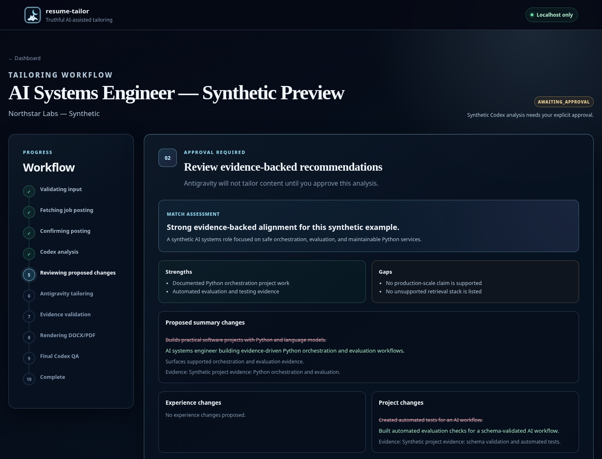
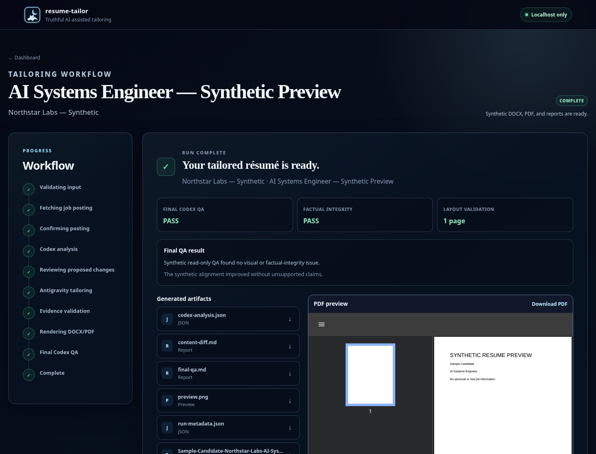
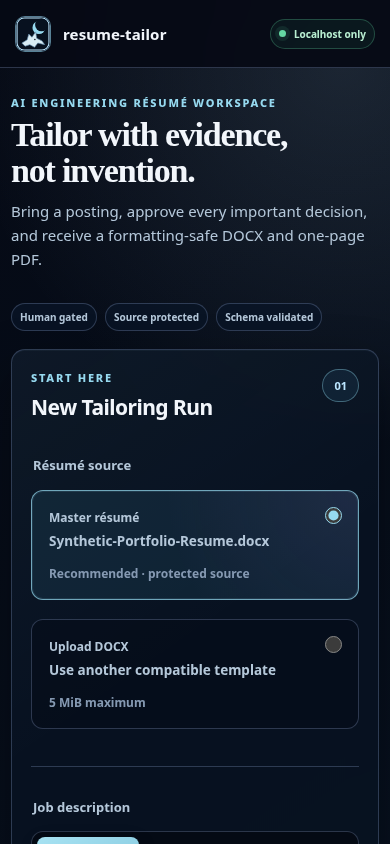

# Resume Tailor

Resume Tailor is a truthfulness-first résumé tailoring pipeline with a
localhost-only review interface. It uses Codex for evidence analysis and final
QA, Antigravity for constrained rewriting and optional public LinkedIn
extraction, and deterministic local checks before producing DOCX and PDF
artifacts.

The project is designed around a simple rule: a desired qualification is not
evidence. Model output remains advisory until it passes local validation and the
user approves the relevant gate.


## What it demonstrates

- Multi-agent orchestration with explicit, bounded responsibilities
- Structured model output backed by JSON Schema
- Local evidence validation that rejects unsupported claims
- Human approval gates before analysis and content changes advance
- Format-preserving DOCX editing and one-page PDF validation
- Prompt-injection boundaries around untrusted job-posting text
- A responsive, accessible FastAPI interface bound only to localhost
- Safe Linux installation with managed desktop entries and timestamped backups

## Architecture

```text
Résumé DOCX + job input
          |
          v
Local DOCX extraction and structural validation
          |
          +--> Optional public LinkedIn extraction (Antigravity)
          |              |
          |              v
          |      Human posting confirmation
          |
          v
Read-only evidence analysis (Codex)
          |
          v
Local schema + evidence validation
          |
          v
Human analysis approval
          |
          v
Plan-only constrained rewrite (Antigravity)
          |
          v
Local factual-integrity and content-budget validation
          |
          v
Human content-diff approval
          |
          v
Deterministic DOCX render + LibreOffice PDF export
          |
          v
Local page, text, geometry, and package checks
          |
          v
Read-only visual/factual QA (Codex)
          |
          v
Local DOCX, PDF, preview, QA report, and metadata
```

### Agent responsibilities

Codex performs two read-only tasks:

1. Compare the trusted résumé extraction with the untrusted posting and produce
   evidence-linked recommendations.
2. Review the final PDF preview and approved content diff for unsupported
   claims, readability, clipping, missing information, and weak alignment.

Antigravity performs two plan/sandbox tasks:

1. Extract a public LinkedIn posting when URL mode is selected. The application
   accepts only HTTPS LinkedIn job URLs and never logs in or interacts with an
   Apply flow.
2. Return a schema-constrained tailored-content proposal based on the trusted
   source and the approved Codex analysis.

Neither agent renders the résumé or silently edits source files. DOCX mutation,
PDF export, factual checks, artifact paths, and source-integrity verification are
local code responsibilities.

## Human approval gates

The interactive pipeline pauses at three consequential boundaries:

1. **Posting confirmation** — confirm the company, title, location, and extracted
   posting before it reaches Codex. A pasted-description fallback is available.
2. **Analysis approval** — review supported edits, immutable facts, forbidden
   claims, and unanswered questions.
3. **Content-diff approval** — inspect the exact proposed changes after local
   evidence validation and before document rendering.

The CLI includes `--yes` for controlled automation, but schema, evidence,
formatting, source-hash, and final-QA checks remain enforced.



## Security model

- The UI host is fixed to `127.0.0.1`; there is no remote-binding option.
- A random launch token protects the localhost session and CSRF-sensitive forms.
- Session cookies are `HttpOnly` and `SameSite=Strict`.
- HTML and XML templates auto-escape model and webpage content.
- Content Security Policy allows only same-origin scripts, styles, images, forms,
  and PDF framing.
- Responses disable caching, MIME sniffing, external referrers, and cross-origin
  framing.
- Uploaded files and forms have byte, field, and expansion limits.
- DOCX uploads must be valid ZIP packages with expected Word parts.
- Artifact downloads enforce filename and directory boundaries.
- External commands use argument arrays rather than a shell.
- Codex runs are ephemeral and read-only; Antigravity runs in plan/sandbox mode.
- Job descriptions are wrapped in unique untrusted-data delimiters with explicit
  prompt-injection instructions.
- The source résumé is hashed before and after every run and is never overwritten.
- Internal work directories are removed unless explicitly retained for debugging.

Résumé and posting content are sent through the user’s authenticated Codex and
Antigravity CLI sessions. They are not confined to the local machine merely
because the web interface binds to localhost. Review the data practices of those
services before processing sensitive material.

## Structured output and local validation

Canonical schemas live in [`schemas/`](schemas/). Codex-compatible transport
schemas are derived and audited locally so provider restrictions do not weaken
the canonical contract.

Model responses are parsed, normalized where explicitly allowed, and validated
with `jsonschema`. Independent local checks then enforce:

- evidence for recommended and rewritten claims;
- immutable employment, education, date, metric, and certification facts;
- allowed technology vocabulary;
- section and bullet-count structure;
- per-paragraph content budgets;
- exact source-document hash preservation;
- DOCX package and relationship preservation;
- one-page PDF output, expected text, and visible bounding boxes.

Model success is therefore necessary but not sufficient for a completed run.

## Synthetic fixture

The repository contains only
[`template/sample_resume.docx`](template/sample_resume.docx), a clearly
synthetic document generated from scratch by
[`tools/build_synthetic_resume.py`](tools/build_synthetic_resume.py). Its names,
organizations, links, dates, credentials, and achievements are fictional.

Real résumés and generated DOCX/PDF files are ignored by Git. Keep private inputs
outside the checkout and supply them at runtime.

## Requirements

- Linux
- Python 3.11 or newer
- LibreOffice
- Poppler tools: `pdfinfo`, `pdftotext`, and `pdftoppm`
- Authenticated `codex` CLI
- Authenticated Antigravity CLI exposed as `agy`
- Google Chrome or Chromium for the app-window experience
- Optional clipboard utility: `wl-paste`, `xclip`, or `xsel`

## Installation

Create the repository-local environment and install the package:

```bash
python3 -m venv .venv
.venv/bin/python -m pip install --upgrade pip
.venv/bin/python -m pip install -e '.[dev]'
```

Verify the required external tools:

```bash
codex --version
agy --version
libreoffice --version
pdfinfo -v
pdftotext -v
pdftoppm -v
```

The optional managed installer copies the application into
`~/.local/share/resume-tailor`, installs launchers under `~/.local/bin`, and
reuses the repository `.venv` through a symlink:

```bash
./install.sh --desktop
```

Use `--force` for an upgrade. Existing managed files are moved to timestamped
backups before replacement. Unrelated desktop files are never overwritten.

The installer does not install dependencies or modify shell or desktop
configuration.

## Launching the interface

From the checkout:

```bash
./tailor-resume-ui
```

After managed installation:

```bash
tailor-resume-ui
```

The launcher reserves the localhost port before startup and detects an existing
healthy instance, so repeated launches open the singleton dashboard instead of
starting competing servers.

Useful options:

```bash
tailor-resume-ui --no-browser
tailor-resume-ui --port 8877
tailor-resume-ui --output-dir /absolute/private/output/path
```

The health endpoint is available at `http://127.0.0.1:8765/health`.

## CLI usage

Use a private résumé outside the repository:

```bash
tailor-resume \
  --resume /absolute/private/resume.docx \
  --job-file /absolute/private/job-description.txt \
  --company "Example Company" \
  --role "AI Engineer"
```

Other input modes:

```bash
tailor-resume --resume /private/resume.docx --clipboard \
  --company "Example Company" --role "AI Engineer"

tailor-resume --resume /private/resume.docx \
  --job-url "https://www.linkedin.com/jobs/view/example-role-1234567890/"
```

The URL shown above is a non-functional documentation placeholder.

## Testing

The suite uses stubbed model CLIs and the synthetic DOCX fixture. It must not
require network access or a real résumé.

```bash
.venv/bin/python -m pytest
```

Additional release checks:

```bash
.venv/bin/python -m compileall -q resume_tailor tests tools
bash -n install.sh uninstall.sh tailor-resume tailor-resume-ui
node --check resume_tailor/static/app.js
jq empty schemas/*.json
git diff --check
```

The document-rendering tests require LibreOffice and Poppler.

## Interface

The responsive UI covers posting confirmation, active analysis, analysis
approval, content-diff approval, failure handling, successful artifacts, and an
inline PDF preview.





The interface uses local CSS and SVG only—no CDN, remote font, tracker, analytics
script, or externally loaded decorative asset.

See [`docs/design.md`](docs/design.md) for design tokens and the bounded
Codex–Antigravity visual-review process.

## Limitations

- The current renderer intentionally targets one strict résumé structure rather
  than arbitrary DOCX layouts.
- Public LinkedIn extraction can fail when a page requires authentication,
  changes markup, blocks access, or is no longer available.
- Model recommendations remain probabilistic and require informed human review.
- Local validation prevents many unsupported edits but cannot guarantee hiring
  outcomes, ATS ranking, or semantic perfection.
- LibreOffice and font differences can affect pagination across systems.
- The localhost UI is a single-user desktop tool, not a hardened multi-tenant
  web service.
- Windows and macOS installation workflows are not provided.

## Development disclosure

This project was designed and directed through AI-assisted development and
prompt engineering. Codex contributed implementation, testing, security review,
and documentation; Antigravity contributed bounded visual critique and serves a
separate constrained role in the runtime pipeline. Human direction defined the
requirements, safety boundaries, approval gates, review criteria, and release
decisions.

The repository intentionally excludes raw agent transcripts, hidden reasoning,
private résumé material, real job postings, run history, and generated user
artifacts.

## License

Licensed under the [MIT License](LICENSE).

Copyright (c) 2026 Logan Lapierre.
